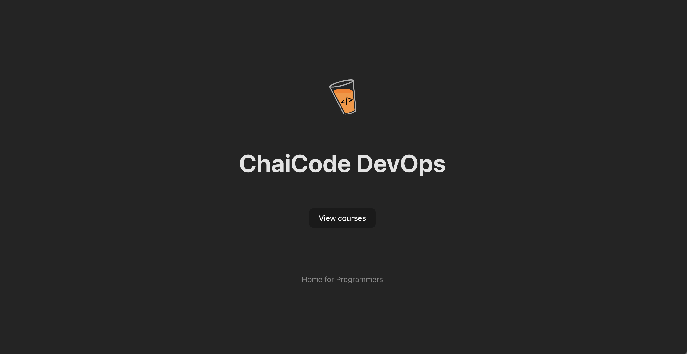
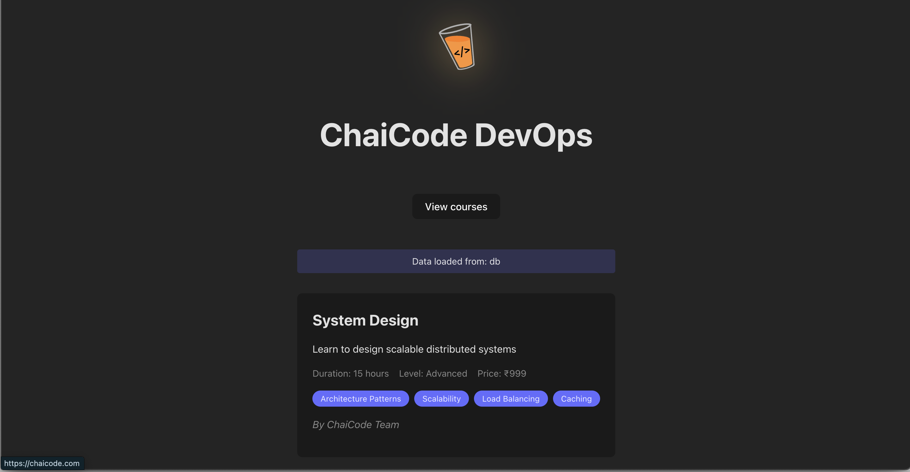
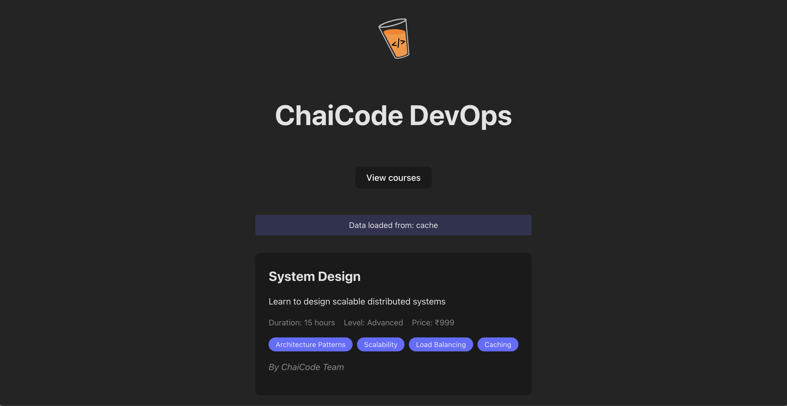

# Chai Code DevOps Assignment

## Assignment Description

The provided repository contains a basic full-stack application with the following components:

1. A basic Express.js server with basic & courses endpoint
2. A React.js frontend application
3. Redis integration for API response caching
4. MongoDB integration for data storage

## Objective

Your task is to containerize the application for a "Development" environment using Docker. Ensure that all components work seamlessly together within their respective containers and work as per the provided screenshots below.

## Note

The application environment variables are stored in a `.env` file. You can find the `.env.example` file in the respective directory. Copy it to `.env` and fill in the required values.

## Screenshots

### Home Page

### Load Data from MongoDB

### API Response Caching

